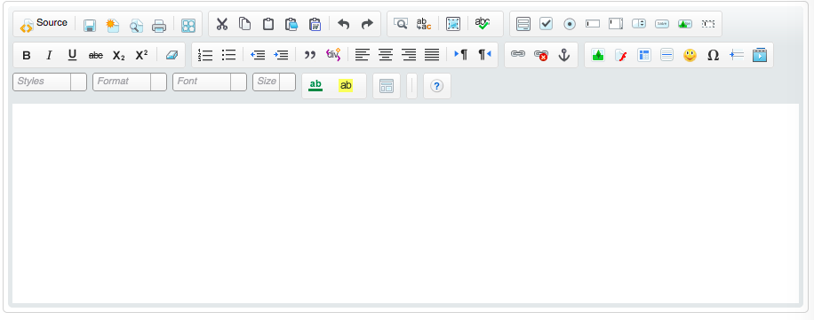
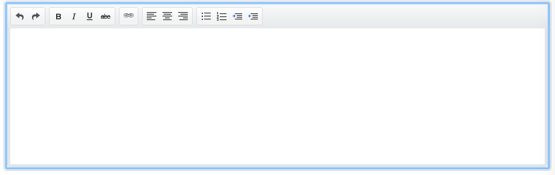
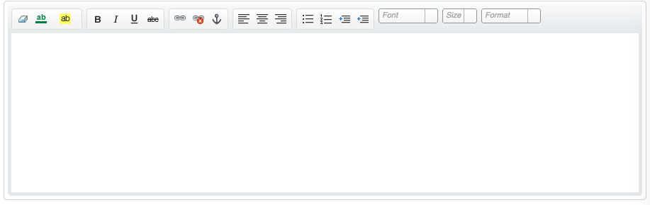
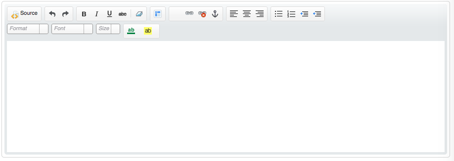

# custom-rtf
<a href="https://githubsfdeploy.herokuapp.com?owner=avinava&repo=custom-rtf">
  
</a>

custom-rtf visualforce component lets you add richtext capability to a text area without losing the ability to rerender the page.

###Features
- converts plain textarea into rtf editor.
- allows rerendering of the page.
- Toolbar options 
 - Full
 - Visualforce
 - HomePageComponent
 - SalesforceBasic
 - EmailMultiFormat
 - Email
 - SalesforceLight
 - Knowledge
 - KnowledgeWithIframes
 - ServiceCommunity

###Syntax
 ```
 <apex:page standardStylesheets="true" docType="html-5.0" sidebar="false">
    <apex:form >
        <c:customrtf targetclass="mytextarea" toolbar="Full"/>
        <apex:inputTextarea styleClass="mytextarea" richText="false"/>
    </apex:form>
</apex:page>
```
###Screenshot
- Full

- Basic

- Email

- Knowledge



### TO DO
- [X] Move js files to static resource
- [X] add different layouts that salesforce allows

